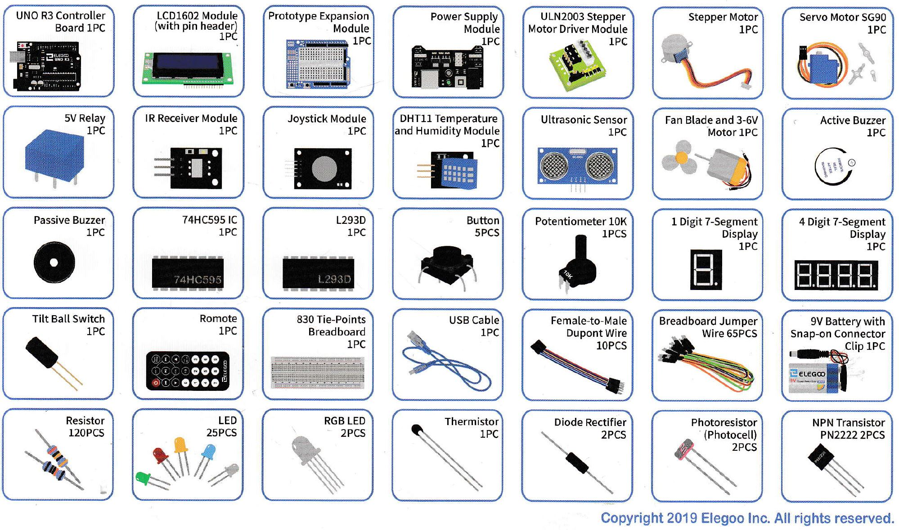

# IEEE TISP Workshop Parts Kit

## Student Arduino Kit

## School Workshop Kit
The school workshop kit includes **30 units** of the *Student Arduino Kit* as well as the following additional supporting items:
- 2x Getting Started Booklet
- 4x Digitial Multimeter for measurement exercises and diagnosis of circuit issues
- 20x SG-90 servo motors for specific multi-motor exercises
- 50x Locking ties to secure the School Workshop Kit blue tote before shipping. 

**Note:** The on-site workshop coordinator should ensure the tote is securely locked with a tie at each side before shipping/transporting the tote to the next school.